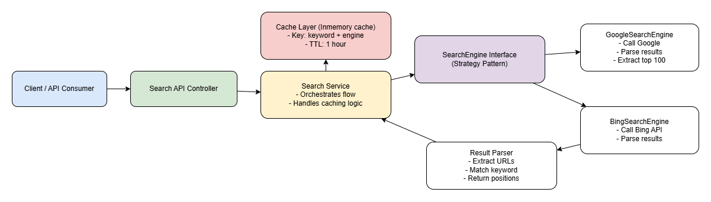

# Search Ranking Automation Service

## 📌 Overview

This project automates the process of checking search engine rankings for a given keyword.

It performs a search on supported search engines (e.g., Google, Bing) and returns the positions where the keyword appears **within the URL** of search results.


## 🚀 Features

- Accepts a keyword and search engine
- Scrapes search results (top 100 only)
- Returns ranking positions where keyword appears in URLs
- Supports multiple search engines (pluggable design)
- In-memory caching (1-hour TTL)
- Cache management API (clear / evict)
- Clean architecture (Controller → Service → Engine → Parser)

---

## System Design


## ⚙️ Tech Stack

- Java 21+
- Spring Boot
- Gradle 
- Built-in Java HTTP client (no external scraping libs)
- ConcurrentHashMap (in-memory cache)

---

## 📂 Project Structure

---

## ▶️ How to Run

### 1. Clone repository

```bash
git clone https://github.com/your-username/search-ranking.git
cd search-ranking
```

### 2. Build project
```bash
 ./gradlew clean build
```

### 3. Run application
```bash
 ./gradlew bootRun
```
### 4. Application run at:
```json
http://localhost:8080
```
## ▶️ Endpoints

### 1. Get Rankings
#### a. Request
```json
    GET /api/v1/rankings?keyword=xolv&engine=google
```
#### b. Response:
```json
    {
  "keyword": "xolv",
  "engine": "google",
  "positions": "0,1,3"
}   
```

### 2. Cache (For testing only)
#### a. clear all cache
```json
    DELETE /api/v1/cache
```
#### b. clear cache by cache
```json
    DELETE /api/v1/cache?keyword=xolv&engine=google
```

### 3. Limitations:
- Search engine may block automated request
- HTMl structure may change
- Results may vary based on:
  - Location
  - Language
  - Personalization
### 4. Future improvement
- Add retry/backoff for HTTP requests
- Improve parser robustness
- Add rate limiting
- Replace cache with Redis
- Add API documentation (Swagger)
- Add metrics (cache hit/miss)